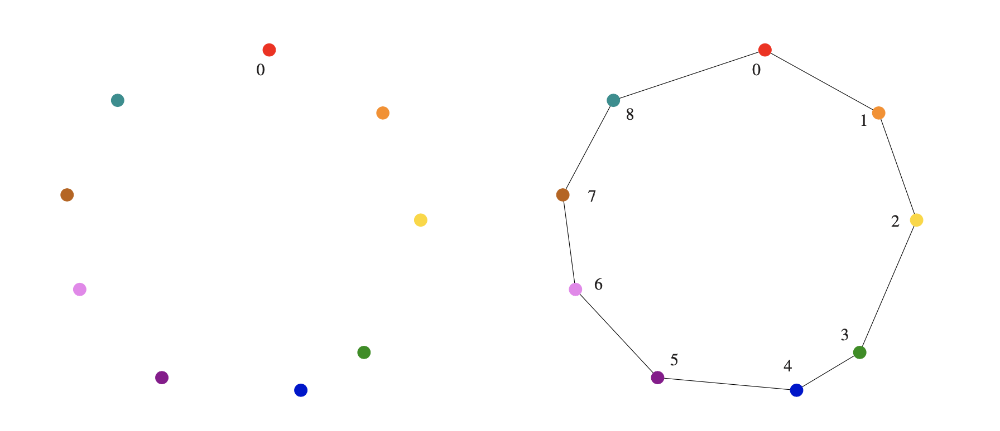
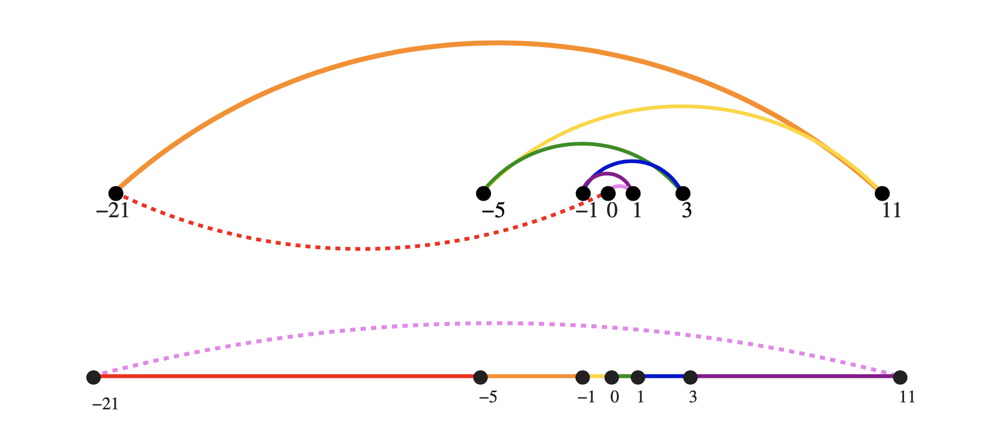
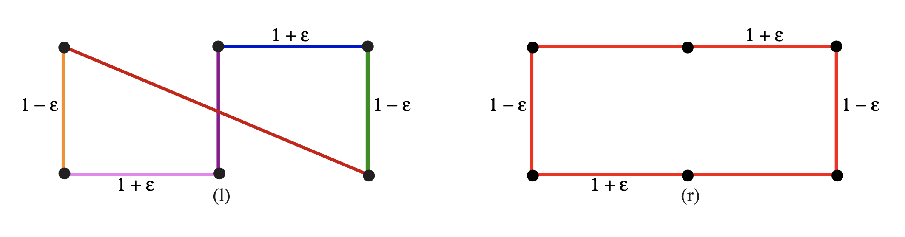

# Robot Tour Optimization

Suppose we are given a robot arm equipped with a tool, say a soldering iron. When manufacturing circuit boards, all the chips and other components must be fastened onto the substrate. More specifically, each chip has a set of contact points (or wires) that need be soldered to the board. To program the robot arm for this job, we must first construct an ordering of the contact points so that the robot visits (and solders) the first contact point, then the second point, third, and so forth until the job is done. The robot arm then proceeds back to the first contact point to prepare for the next board, thus turning the tool-path into a closed tour, or cycle.
Robots are expensive devices, so we want the tour that minimizes the time it takes to assemble the circuit board. A reasonable assumption is that the robot arm moves with fixed speed, so the time to travel between two points is proportional to their distance.



```pseudocode
Problem: Robot Tour Optimization
Input: A set S of n points in the plane
Output: The shortest cycle tour that visits each point in the set S
```

## Nearest-neighbor heuristics

- Starting from p<sub>0</sub> find its nearest neighbor p<sub>1</sub>. From there, find its nearest unvisited neighbor. Repeat until all nodes have been visited and return to p<sub>0</sub>.

```pseudocode
Nearest Neighbor (P):
  Pick and visit p0 from P
  p = p0
  i = 0
  While there are still unvisited nodes
    i += 1
    Select pi to be the closest unvisited point to pi−1
    visit pi
  return to p0 from pn-1
```

## Seems good. Now why is it wrong?



## Closest pair heuristics

- Repeatedly connect the closest pair of endpoints whose connection will not create a problem, such as premature termination of the cycle. Each vertex begins as its own single vertex chain. After merging everything together, we will end up with a single chain containing all the points in it. Connecting the final two endpoints gives us a cycle.

```pseudocode
ClosestPair(P):
  n = number of points in set P
  For i=1 to n -1:
    d = infinity
    for each pair of endpoints (s, t) from distinct node chains:
      if dist(s, t) <= d
        sm = s
        tm = t
        d = dist(s, t)
    connect (sm, tm) by an edge
  connect two endpoints by an edge
```

## Seems good. Now why is it wrong?



## TSP

- Enumerate all possible ordering of the set of endpoints and select the one that minimizes the total length

```pseudocode
OptimalTSP(P):
  d = infinity
  for each of the n! permutations Pi of point set P:
    if cost(pi) <= d:
      d = cost(pi)
      pmin = pi
    return pmin
```

- This algorithm is obviously correct. However, it is extremely slow.

## Take-home lesson

- There is a fundamental difference between:
  - **algorithms**, procedures that always produce a correct result,
  - and **heuristics**, which may usually _do a good job but provide no guarantee of correctness_.
