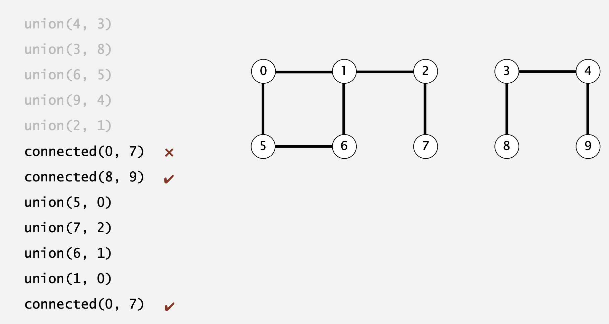
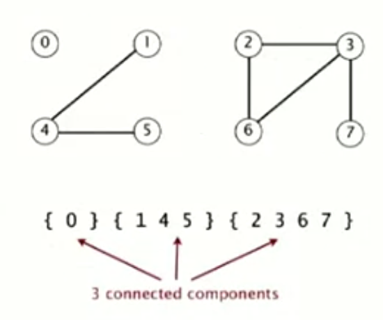

# Algorithms

## Union-Find

- Steps to **develop** a usable algorithm
	1. model the problem
	2. find an algorithm
	3. check its time and space complexity
	4. if subpar, find out why
	5. Address the issue
	6. iterate until satisfied

### Dynamic connectivity

- Given a set of N Objects
	- **Union command**: connect two objects
	- **Find/connected query**: is there a path connecting the two objects



- Modeling:
	- *is connected to* is an <u>equivalence relation</u>
		- symmetric: p is connected to q and vice versa
		- Reflexive: p is connected to itself
		- Transitive: p connected to q and q to r, then p to r
	- **connected componenets**: maximal set of objects that are mutually connected



- Implement the operation:
	1. **find query**: check if two objects are in the same componenets
	2. **union command**: replace components contain gin two objects with their union
- Union-find data type (API)
	- Goal: design efficient data structure for union-find
		- number of objects N can be huge
		- number of operations M can be huge
		- find queries and union commands may be intermixed

```pseudocode
public class UF {
	UF( int N) // initialize union-find data structure with N objects (0 to N-1)
	void union (int p, int q) // add connection between p and q
	boolean connected (int p, int q) // are p and q in the same component
	int find (int p) // component identifier for p (0 to N-1)
	int count() // num of components
}
```

