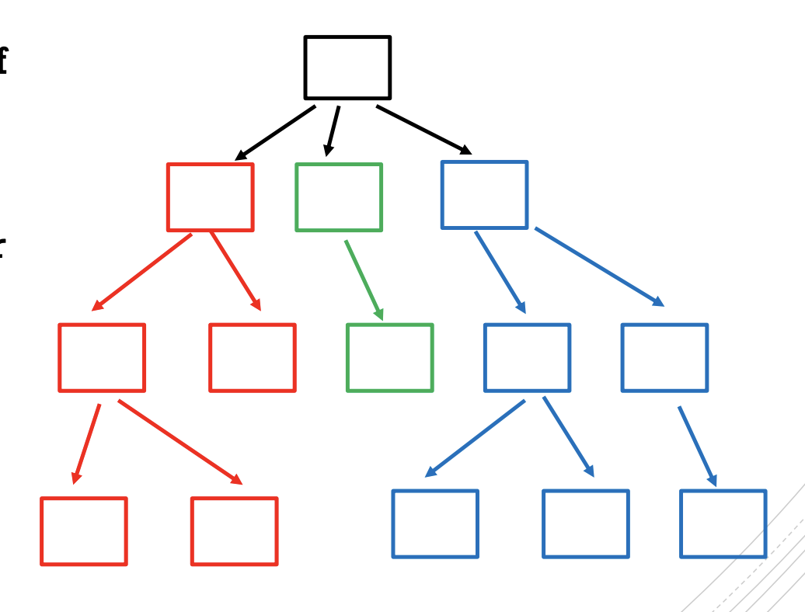

# Data Structures and Algorithms

---

## ArrayList

- Array with primitive elements: `int[] myInts = new int[15];`
- Array with reference elements: `Shape[] myShapes = new Shape[428];`
- A computer accesses an element in an array in **constant time**
	- meaning the size of the array does not matter

- **List**: an ordered set of elements a~0~, a~1~, a~2~, a~3~, a~4~,...,a~n-1~
	- `n` being the number of elements in the list, or the **size** of the list
	- three implementations of a list:
		1. Array List
		2. Singly linked list
		3. Doubly linked list
- **ArrayList**: 
	- use an array to store the elements of the list; and keep track of how many elements we have inserted in the list
	- Java ArrayList creates an array of **length 10**


```java
public class ArrayLIst {
    private Shape[] arr;
    private int size;
    
    public ArrayList() {
        arr = new Shape[10];
        size = 10;
    }
    
    public Shape get(int i) {
        if (i >= 0 && i < size) {
            return arr[i];
        } else {
            throw new IndexOutOfBoundsException("Out of Bounds.");
        }
    }
    
    public Shape set(int i, Shape e) {
        if (i >=0 && i < size) {
            Shape temp = arr[i];
            arr[i] = e;
            return temp;
        }
    }
    
    public void add (Shape e) {
        arr[size] = e;
        size += 1;
    }
}
ArrayList list = new ArrayList();
```

- `ArrayList` is a generic class with a type parameter
	- When you create an object of type `ArrayList` you specify the type of the elements stored by the list by appending to `ArrayList` a class name enclosed in `< >`

```java
// create an arraylist of integers with initial capacity 10
ArrayList<Integer> words = new ArrayList<Integer>();

// create an arraylist of shapes with initial capacity 23
ArrayList<Shape> myShapes = new ArrayList<Shape>(23);
```

- **Wrapper classes**: `Integer`, `Double`, `Character` wrap a value of the primitive type `int`, `double`, `char` respectively <u>in an object</u>
	- Meaning they turn primitive types into reference types
- The conversion between the primitive types and their wrappers is done automatically: `Integer x = 5` (no compile-time error)
- **Autoboxing**: the <u>automatic conversion that Java compiler makes between the primitive types and their corresponding object wrapper classes</u>.
	- conversion in the other way is called **unboxing**
- **for each loop**

```java
int[] numbers = {1, 2, 3, 4, 5};
for(int element: numbers) {
    System.out.println(element);
}
```

## Singly Linked Lists

- ArrayList v.s. Linked List


- Singly Linked List Node

```java
class SNode {
    Shape element;
    SNode next;
}

SNode myNode = new SNode();
n.element = new Shape();
```

- A linked list is **a sequence of nodes** along with **a reference to the <u>head</u> and <u>tail</u> node**.


```java
public class SLinkedList {
    private SNode head;
    private SNode tail;
    private int size;
    private class SNode {
        Shape element;
        SNode next;
    }
}

SLinkedList list = new SLinkedList();
```


- `addFirst()`

```pseudocode
SNode newNode = new SNode();
newNode.element = e;
newNode.next = head;
// edge case
if (head == null)
	tail = newNode;
head = newNode;
size = size + 1;
```


- `removeFirst()`

```pseudocode
SNode tmp = head;
// edge case: size = 0
if size == 0
	throw exception
head = tmp.next;
tmp.next = null;
size--;
// edge case: size = 1
if size == 0
	tail = null;
return tmp.element;
```


- **Time Complexity**: let N be list size


## Doubly Linked Lists

- Doubly linked list: each node has a reference to the next node AND to the previous node


```java
class DNode {
    Shape element;
    DNode next;
    Dnode prev;
}

DNode myNode = new DNode();
n.element = new Shape();

public class DLinkedList {
    private DNode head;
    private DNode tail;
    private int size;
    
    private class DNode {
        Shape element;
        DNode next;
        DNode prev;
    }
}

DLinkedList list = new DLinkedList();
```

- **Time Complexity**:


- ArrayList v.s. Linked list:
	- both take **O(N)** to add/remove from position `k`

## Quadratic Sorting:

- Time complexity: O(N^2^)

### Bubble sort

- traverse the list repeatedly
	- if out of order elements are found, swap them

```javascript
for (let i = 0; i < list.length; i++) {
    for (let j = 0; j < list.length - 1; j++) {
        if (list[j] > list[j+1]) {
            let store = list[j];
            list[j] = list[j+1];
            list[j+1] = store;
        }
    }
}
```

### Selection sort

- partition the list into two parts
	- one sorted and the other unsorted
- **Procedure**:
	1. select smallest element in the unsorted part of the list
	2. swap the element with element in the initial position of the unsorted array
	3. Change where you divide the array from sorted part to the unsorted part

```js
for ( let i = 0; i < list.length - 1; i++ ) {
    let min = i;
    for ( let j = i + 1; j < list.length; j++ ) {
        if (list[j] < list[min]) {
            min = j;
        }
    }
    if (min != i) {
        [list[min], list[i]] = [list[i], list[min]];
    }
}
```

### Insertion sort

- divide list into two parts
	- one sorted
	- another unsorted
- **Procedure**:
	1. select first element of the unsorted 
	2. insert selected element into correct position in the sorted part of list
	3. change division of list

```js
for ( let i = 0; i < list.length; i++ ) {
    let element = list[ i ];
    let j = i;
    while ( j > 0 && element < list[j-1]) {
        list[j] = list[j-1];
        j--;
    }
    list[j] = element;
}
```

## Asymptotic notations

### Big O

- Let t(n) be a well-defined sequence of integers. 
	- Let t(n) and g(n) be two sequences of integers, where n >= 0. We say that t(n) is ***asymptotically bounded above by*** g(n) if there exists a positive number n~0~ such that, for all n >= n~0~, t(n) <= g(n). That is t(n) **becomes less than or equal to g(n) once n becomes sufficiently large**.
	- **Example**: t(n) = 5n + 70 is for sure **not** asymptotically bounded above by n, however, it is by 6n.
- Big O allows us to define an aymptotic upper bound on t(n) in terms of *a simpler function* g(n):
	- `1, log(n), n, nlog(n), n^2, n^3, 2^n, ...`
- **Defintion**: Let t(n) and g(n) be well-defined sequences of integers. We say t(n) is O(g(n)) if there exists two positive numbers n~0~ and c such that, for all n >= n~0~, `t(n) <= c g(n)`.
	- We say **t(n) is big O of g(n)**

### Analysis of Algorithms

- Time taken by an algorithm depends on the input and it grows with the size of such input.
	- this is why we desribe the **running time of an algorithm with a function of the size of its input**.
- *input size* depends on the problem being studied, and it can vary depending on the algorithm
	- it can be
		- number of elements in the input
		- number of bits required to represent the input
		- multiple numbers
- *running time* is the number of primitive operations executed

### O(1)

- f(n) is O(1) if there exists two positive constants n~0~ and c such that, for all n >= n~0~
	- f(n) is **bounded by a constant**.

### Scaling

- For all constant factors *a*> 0, if f(n) is O(g(n)), then `a * f(n)` is also O(g(n)).

### Sum Rule

- If f~1~(n) is O(g(n)) and f~2~(n) is O(g(n)), then f~1~(n) + f~2~(n) is O(g(n)).

### Produce Rule

- If f~1~(n) ia O(g(n)) and f~2~(n) is O(g(n)), then f~1~(n) * f~2~(n) is O(g~1~(n) * g~2~(n)).

### Transitivity Rule

- If f(n) is O(g(n)) and g(n) is O(h(n)), then f(n) is O(h(n)).

### Bounds


### Big Omega Ω( )

- Aymptotic lower bounds: algortihms take ***at least*** a certain time to run as a function of input size *n*.
- f(n) is asymptotically bounded below by g(n) if there exists an n~0~ such that, for all n >= n~0~, f(n) >= g(n).
- Given a function g(n), we denote by Ω(g(n)), ***big-omega of g of n***.
	- Ω notation describes an **asymptotic lower bound**.

### Big Theta θ( )

- Given a function g(n), we denote by θ(g(n)), ***big theta of g of n***, the following set of functions:
	- θ(g(n)) = { f(n): there exists positive constants c~1~, c~2~, and n~0~ such that c~1~g(n) <= f(n) <= c~2~g(n) for all n >= n~0~.
	- We use big theta to describe an **asymptotic tight bound**.

## Stacks and Queues

### Abstract Data Type (ADT)

- ADT is **a model for a data type**. It defines a data type by its behavior from the user's perspective only. It describes the possible values and the set of possible operations on the data type.
	- ignores the details of implementation
	- **more abstract than a data structure**. A data structure is a concrete representation of data which includes the implementation details.
- Example: List ADT

```pseudocode
get(i);
set(i, e);
add(i, e);
remove(i);
remove(e);
...
```

- **Stack ADT**:

	- A stack is a list. However, it **does not** have operations to access the list element i directly. Instead one accesses only the element at one end of the list.

	

```pseudocode
push(element);
pop();

isEmpty();
peek();
```

### Stack Overflow and Underflow

- Overflow: a stack has a finite capacity and we attempt to push
- Underflow: a stack is empty and we attempt to pop

### Queue ADT

- enqueue(e): add at back
- dequeue(): remove from front


### Stack vs Queue


## Induction and Recursion

### Proof

```math
1 + 2 + 3 + ... + n
= n* (n+1) * 0.5
```

- Consider `n/2` pairs,
	- if n is even, sum is `n/2*(n+1)`
	- if n is odd, sum is `((n-1)/2*n)+n`

### Recursive (inductive) Definition

- some set of elements can be defined recursively / inductively
- A recursive / inductive definition consists of the following:
	- **base clause**: one or more basic/initial element of the set
	- **inductive clause(s)**: rules on how to generate *new* elements of the set from *old* ones
	- **final clause**: states that no other element is part of the set

### Example: natural numbers

- set of natural numbers can be defined as:
	- base clause: 0 is a natural number
	- inductive clause: if n is a natural number, n+1 is also a natural number
	- final clause: nothing else is a natural number

### Mathematical Induction

- Consider `for all n >= n0, p(n) is true` where n~0~ is some constant and proposition p(n) has value true or false for each n
	- if n is an element of an inductively defined set, then the statement above can be proven using a technique called ***mathematical induction***.

### Recursive Algorithm

```js
const countdown = (i) => {
    if (i === 0) {
        console.log(0);
        return 0;
    }
    console.log(i);
    countdown(i-1);
};
```

- Recursive functions consist of
	- **base case**: one (or a finite number) of terminating scenario that does not use recursion to produce an answer
	- **recursive (inductive) steps**: rules that determine how to produce an answer from simpler cases

### Recursive vs. Iteration

- recursion and iteration are equally expressive
	- anything recursion can do, iteration can do and vice versa

### Example: decimal to binary

```js
answer = [];
const decimalToBinary = (num) => {
  if (num === 0) {
    return 0;
  }
  if (num === 1) {
    answer.unshift(1);
    return answer;
  }
  answer.unshift(num % 2);
  num -= num % 2;
  num /= 2;
  return decimalToBinary(num);
};
```

- Algorithm:
	1. procedure BinaryExpansion(n)
	2. if n > 0, BinaryExpansion(n/2); print(n%2);

### Binary Search

- Search a list
	- **Goal**: find a given element in a list
	- **Solution**: go through all elements in the list and check whether the element is there
- **Inputs**:
	1. a sorted list
	2. the element we're looking for aka the <u>**key**</u>
- **Idea**:
	1. if key is less than the middle element, only search the first half
	2. if key is greater than middle element, only search the latter half
	3. if key is the middle element, return its index

```js
const binarySearch = (arr, key) => {
  let midIndex = Math.floor((arr.length - 1) / 2);
  let mid = arr[midIndex];
  if (key === mid) {
    return "Found";
  } else if (key < mid && arr.length > 0) {
    return binarySearch(arr.slice(0, midIndex), key);
  } else if (key > mid && arr.length > 0) {
    return binarySearch(arr.slice(midIndex + 1, arr.length), key);
  } else {
    return "Not Found";
  }
};
```

### Merge sort

- Merge sort is **divide and conquer algorithm**
	- **IDEA**:
		1. partition the list into two halves
		2. sort each hald recursively
		3. merge sorted half maintaining the order

- A recursive algorithms that will sort the input array by dividing the input array in half and solve each half recurvisely, finally combine the results.


```pseudocode
C = output array {length = n}
A = 1st sorted array {length = n/2}
B = 2nd sorted array {length = n/2}
i, j = 1

for k = 1 to n:
	if A(i) < B(j)
		C(k) = A(i)
		i++
	else
		C(k) = B(j)
		j++
```

```python
def merge_sort(list):
    if len(list) > 1:
        half = len(list)//2
        i = j = k = 0
        left = list[:half]
        right = list[half:]
        merge_sort(left)
        merge_sort(right)

        while i < len(left) and j < len(right):
            if left[i] < right[j]:
                list[k] = left[i]
                i += 1
            else:
                list[k] = right[j]
                j += 1
            k += 1

        while i < len(left):
            list[k] = left[i]
            k += 1
            i += 1

        while j < len(right):
            list[k] = right[j]
            k += 1
            j += 1
```

- Running Time: Merge sort on an array of size `m` is smaller or equal to `4m+2`
	- For every input array of size `n`, merge sort produces a sorted output array and uses at most **6nlog~2~n+6n** operations

- **Solving it recursively**:


```js
const merge = (arr1, arr2) => {
  let merged = [];
  while (arr1.length && arr2.length) {
    if (arr1[0] < arr2[0]) {
      merged.push(arr1.shift());
    } else {
      merged.push(arr2.shift());
    }
  }
  return [...merged, ...arr1, ...arr2];
};

const mergeSort = (arr) => {
  if (arr.length <= 1) {
    return arr;
  } else {
    let listA = arr.splice(0, arr.length/2);
    return merge(mergeSort(listA), mergeSort(arr));
  }
};
```

### Quick Sort

- Quick sort is also a **divide and conquer algorithm**
- **IDEA**:
	1. pick and element of the array: **the pivot**
	2. partition the list moving the pivot to its correct position
		- make sure all teh lower elements are on its left and all larger elements on its right
	3. sort left part and right part recursively
	4. Keep sorting until there's no elements left


- **Pivot**: can be picked in different ways
	- the first element
	- the last element
	- a random element
	- median

```js
const quickSort = (arr) => {
  let pivot = arr[0];
  while (!arr === arr.sort(function(a, b) { return a > b ? 1 : -1})) {
    for (let i = 1; i < arr.length; i++) {
      if (arr[i] < pivot) {
        arr.shift(arr[i]);
        arr.splice(i, 1);
      } else {
        arr.push(arr[i]);
        arr.splice(i, 1);
      }
    }
    quickSort(arr);
  }
  return arr;
};
```

### Merge sort vs Quick sort

- merge sort uses an extra list. More space can hurt performance for big lists

### Recurrences

- A **recurrence** is an equation or inequality that describes a function in terms of its value on smaller inputs

### How to solve a recurrence

- Different methods to solve a recurrence:
	1. forward substitution
	2. back substitution
	3. Recursion-treee method
	4. Master theorem
	5. and more...


## Rooted Trees

- Two kinds of data structures

	1. Linear:

		- array
		- linked list
		- etc

	2. Non-linear:

		- Tree 

		

		- Graph

		

### Terminology

- A tree is a collection of **nodes** (**vertexes**)
	- The **root** is the top node in a tree


- A **directed edge** is ordered pair of nodes (v~i~, v~j~) `(from, to)`
	- Trees can be **undirected or directed**.
	- If directed, the edges are either **<u>all</u> pointing away from the root** or **<u>all</u> pointing twowards the root**


- A **child** is a node directly connected to another node when moving away from the root
- A **parent** is a node directly connected to another node when moving towards the root
- Every node except the root **is a child** and has **exactly one parent**


- Two node are **siblings** if **they have the same parent**


- An **internal node** is a node with **at least one child**
- An **leaf (external node)** is a node with **no children** 


- A **path** in a tree is a **sequence of nodes** (v~1~, v~2~,..., v~k~) such that (v~i~, v~i+1~) is an edge.
- The **length** of a path is **the number of edges in the path** (aka the number of nodes in the path minus 1)
- *Note*: a path with **just one node** (v~1~) has length of **0** since it has no edges


- Node *v* is an **ancestor** of node *w* is there is a path from *v* to *w*. 
	- We can also say that *w* is a **descendent** of node *v*.


- The **depth (level)** of a node is the length of the path from the root to the node.


- The **height** of a node is the **maximum length of a path from that node to a leaf**


### Edge Direction

- For some trees,
	- edges are directed from parent to child
	- edge are directed from child to parent
	- Edge are directed both from parent to child and child to parent
	- Edge direction is ignored
- **Most definitions will assume edges are from parent to child**

### Non-rooted trees

- Non-rooted trees are most common when edges are **undirected** and there is no natural way to **defined the root**


### Number of edges

- If a rooted tree has *n* nodes, then it has ***n-1*** edges
	- Because every edge is of the form `(parent, child)` and each node **except the root** is a child and each child has exactly one parent

### Recursive definition of rooted tree

- A tree T is a **finite and possibly empty** set of *n* nodes such that
	- if n > 0, then one of the nodes is the root r
	- if n > 1, then n -1 non-root nodes are partitioned into non-empty subsets T~1~, T~2~, ..., T~k~, each of which is a tree (**subtree**) and the roots of the subtrees are the children of root r.



### Another definition of rooted trees

```pseudocode
tree = root | (root listOfSubtrees)
listOfSubtrees = tree | tree listOfSubtrees
*listOfSubtrees cannot be empty
```

```pseudocode
(6 (2 1 7) 3 (4 5) (9 8 0))
```


### Compute the depth of a node

- Do this efficiently, we require nodes to **have a parent link**. This is *analogous* to a *previous* link is a doubly linked list

```pseudocode
// find the depth/level of node v

depth (v) {
	if (v.parent == null) 
		return 0
	else 
		return 1 + depth (v.parent)
}
```


### Compute the height of a node

```pseudocode
height (v) {
	if (v is a leaf)
		return 0
	else 
		h = 0
		for each child w of v
			h = max (h, height(w))
		return 1 + h
}
```

### Implementation of a tree

- Similar to linked lists
	- Create a data type to represent tree nodes
	- represent a tree with a pointer to the root node

```java
class Tree<T> {
    TreeNode<T> root;
    
    class TreeNode<T> {
        T element;
        ArrayList<TreeNode<T>> children;
    }
}
```

- Another implementation: **first child, next sibling**


```java
class Tree<T> {
    TreeNode<T> root;
    
    class TreeNode<T> {
        T element;
        TreeNode<T> firstChild;
        TreeNode<T> nextSibling;
        TreeNode<T> parent;
    }
}
```

```js
class treeNode {
  constructor(value) {
    this.value = value;
    this.descendants = [];
  }
}

// create nodes with values
const root = new treeNode("pet store");
const cat = new treeNode("cat");
const dog = new treeNode("dog");

// associate children with its parent
root.descendants.push(dog, cat);

const beagle = new treeNode("beagle");
const golden = new treeNode("golden retriever");
const husky = new treeNode("husky");

dog.descendants.push(beagle, golden, husky);

const shortHair = new treeNode("English short hair");
const garfield = new treeNode("garfield");

cat.descendants.push(shortHair, garfield);
```


## Tree Traversals

- The question of how to visit (enumerate, iterate through, traverse) all the nodes of a tree?
	- Depth First Search (**DFS**)
	- Breadth First Search (**BFS**)

### Depth First Preorder

```pseudocode
depthFirst (root) {
	if (root is not empty) 
		visit root
		for each child of root
			depthFirst (child)
}
```

- **preorder traversal**: visit the root before the children
- **visit a node**: 
	- this implies that **you do something at that node**


### Depth First Postorder

- **post order**: visit the children before the root

```pseudocode
depthFirst (root) {
	if (root is not empty) {
		for each child of root
			depthFirst(child)
		visit root
	}
}
```


### Call sequence of `depthFirst()`

- The call sequence of `depthFirst()` is the same for preorder and postorder implementation 


- **call stack of `depthFirst(root)`**


### Non-recursive implementation of tree traversal

- **Stack**: `depth first`

```pseudocode
treeTraversalStack (root) {
	stack s = empty
	s.push (root)
	while s is not empty {
		current = s.pop()
		visit current
		for each child of current
			s.push(child)
	}
}
```


```js
// preorder
const DFS = (root) => {
  if (root !== undefined) {
    console.log(root.value);
    for (let i = 0; i < root.children.length; i++) {
      DFS(root.children[i]);
    }
  }
};

DFS(root);

// post order
const DFSPost = (root) => {
  if (root !== undefined) {
    for (let i = 0; i < root.children.length; i++) {
      DFS(root.children[i]);
    }
    console.log(root.value);
  }
};
DFSPost(root);

// stack
const DFSStack = (root) => {
  const s = [];
  s.push(root);
  while (s.length !== 0) {
    let current = s.pop();
    console.log(current.value);
    for (let i = 0; i < current.children.length; i++) {
      s.push(current.children[i]);
    }
  }
};
```

### Breath first traversal

- **Queue**:
	- for each level i
		- Visit all nodes at level i

```pseudocode
treeTraversalQueue (root) {
	queue q = empty
	q.enqueue (root)
	while q is not empty {
		current = q.dequeue()
		visit current
		for each child of current
			q.enqueue(child)
	}
}
```


```js
const BFS = (root) => {
  const queue = [];
  queue.push(root);
  while (queue.length > 0) {
    let current = queue.shift();
    console.log(current.value);
    for (let i = 0; i < current.children.length; i++) {
      queue.push(current.children[i]);
    }
  }
};
```

## Binary Trees

- Each node has **at most** two children


- In a binary tree of height *h*, 
	- the maximum number of nodes *n* is 2^h+1^-1
	- the minimum number of nodes n is h+1
- **Implementation of Binary Tree**

```java
class BinaryTree<T> {
    BTNode<T> root;
    
    class BTNode<T> {
        T element;
        BTNode<T> leftChild;
        BTNode<T> rightChild;
    }
}
```

- **DFS in Binary Tree**

```pseudocode
preorder (root) {
	if (root is not empty) {
		visit root
		preorder(root.left)
		preorder(root.right)
	}
}

postorder (root) {
	 if (root is not empty) {
	 	postorder(root.left)
	 	postorder(root.right)
	 	visit root
	 }
}

inorder (root) {
	if (root is not empty) {
		inorder(root.left)
		visit root
		inorder (root.right)
	}
}
```


## Expression Trees


- Internal nodes are **operators**
- Leaves are **operands**
- An expression tree can be a way of **thinking about the ordering of operations used when evaluating an expression**
- **Prefix** expressions called *polish notation*
- **Postfix** expression called *reverse polish notation* (**RPN**)

## Binary Search Trees

- Definition:
	- binary tree
	- keys are comparable and unique 
		- **No duplicates**
	- for each node, **all** descendants in left subtree are less than the node, and **all** descendants in the node's right subtree are greater than the node
		- comparison is based on node key
- Example of Binary search tree


- Example: **Not** a binary search tree
	- because j is larger than f


### BST ADT

```pseudocode
find(key)
findMin()
findMax()
add(key)
remove(key)
```

### `find()`


- `find(root, g)` returns the `g` node
- `find(root, s)` return `null`

- Implementation

```pseudocode
find(root, key) {
	if (root == null) {
		return null
	} else if (root.key == key) {
		return root
	} else if (key < root.key) {
		return find(root.left, key)
	} else {
		return find(root.right, key)
	}
}
```

### `findMin()`

- Return the node with the smallest key

```pseudocode
findMin() {
	if (root == null) {
		return null
	} else if (root.left == null) {
		return root
	} else {
		return findMin(root.left)
	}
}
```

- `findMax( )` is similar but for `root.right`

### `add()`

- add a new node to the tree
	- a new node is always a **leaf**

```pseudocode
add(root, key) {
	if (root == null) {
		root = new node(key)
	} else if (key < root.key) {
		root.left = add (root.left, key)
	} else if (key > root.key) {
		root.right = add (root.right, key)
	}
	return root
}
```

### `remove()`

```pseudocode
remove(root, key) {
	if ( root == null ) {
		return null;
	} else if (key < root.key) {
		root.left = remove (root.left, key)
	} else if (key > root.key) {
		root.right = remove (root.right, key)
	} else if (root.left == null) {
		root = root.right
	} else if (root.right == null) {
		root = root.left
	} else {
		root.key = findMin (root.right).key
		root.right = remove(root.right, root.key)
	}
	return root
}
```

### Balance in BST

- A BST is **balanced** when height is `log(n+1)-1` and n = 2^h+1^-1


- **Maximally unbalanced** when height is n-1


### Time Complexity Analysis

- for maximally unbalanced bst
	- all methods have a base case of `O(1)` and worst case of `O(n)`
- For balanced bst
	- all methods but `find()` have a best case of `O(log n)` and worst case of `O(log n)`
	- `find()` has a best case of `O(1)`

## Heaps

- Assume a set of comparable elements or *keys*
	- like a queue, but now there is a more general defintion on element removal:
		- remove the one with highest priority 
	- Example: ER room
- Priority Queue ADT

```pseudocode
add(key)
removeMin()
peek()
contains(element)
remove(element)
```

### Complete Binary Tree

- **Definition**: Binary tree of height *h* such that **every level less than h is full** and **all nodes at level h are as far to the left as possible**


### Min Heap

- **Definition**: Complete binary tree with **unique comparable** elements/keys, such that **each node's key is less than its children's key**


- `add( )`

```pseudocode
add (key) {
	current = new node at next available leaf position
	current.key = key
	if (root == null) {
		root = current
	} else {
		while (current != root && current.key < current.parent.key) {
			swapKeys(current, current.parent)
			current = current.parent
		}
	}
}
```

- `removeMin()`: return root element

```pseudocode
removeMin() {
	temp = root.key
	remove the last leaf node and store its key into the root
	current = root
	while (current.left != null && current.key > current.left.key) || (current.right != null && current.key > current.right.key) {
		minChild = child with smaller key
		swapKeys(current, minChild)
		current = minChild
	}
	return temp
}
```

### Build a heap (the fast way)

- Half the nodes of a heap are leaves
	- each leaf is a heap with one node
- The last non-leaf node has index size/2

## Maps

### Mathematics

- A map is a set of pairs `{(x, f(x))}`
	- each x in domain maps to exactly one f(x) in codomain
	- But f(x~1~) = f(x~2~) for different x~1~. x~2~, aka many-to-one


### Map ADT

- A map is a set of (key, value) pairs
	- for each key, there is at more one value
	- However, it's possible for two keys to map to the same value
	- It is **NOT** allowed for a key to have two different values
	- **Black dots** indicate objects of type K (keys) or V (values) that are ***not*** in the map
	- Each (key, value) pair is called an ***entry***
		- In the graph below, there are four entries.


```pseudocode
put(key, value)
// add the entry (key, value) to the map. If the map previously contained an entry with key, the old value is replaced by the specified value

get(key)
// returns the value to which the specified key is mapped

remove(key)
// remove the entry with the specified key. return true if the entry was removed, false otherwise
```

## Hash Maps

### Terminology

- A `hashCode` maps keys to `int`
- A `hash function` maps keys to `hash values`
- We use values both to refer to the values of the hash function as well as the values in the key-values pairs of the map we wish to represent

### Problem: Collisions

- Two or more keys can map to the same `hash value`
- **Solution**: hash table / hash map
	- each array slot holds a singly linked list of entries

### Buckets

- Each array slot + linked list is called **a bucket**. This map below has *m* buckets


### Load factor

- load factor equals to the *number of (key, value) pairs in map* over *the number of buckets, m*
- One typically keeps the load factor below 1. In Java `HashMap` class, the default MAXIMUM load factor is `0.75`

## Graphs


- Definition: A directed graph is ***a set of vertices*** and a set of ordered pairs of these vertices called edges
	- V = {V~i~: i ∈ {1, ..., n}}
	- E = {(v~i~, v~j~) : i, j ∈ {1, ..., n}}
	- In an undirected graph, the edges are *unordered paris*


		- E = {{v~i~, v~j~} : i, j ∈ { 1, ..., n }}
		



### Terminology

- **in degree**: in directed graph, count of edges going in


- **out degree**: opposite of in degree


- **Path**: a path is a sequence of edges such that the end vertex of one edge is the start vertex of the next edge and no vertex is repeated except maybe the first and last


- **cycle**: a cycle is a path such that the **last vertex is the same as the first vertex**


### Directed acyclic graph

- A directed acyclic graph (DAG) is a graph that is **directed and without cycles connecting the other edges**. 
	- This means that it is **impossible to traverse the entire graph starting at one edge**. 
	- The edges of the directed graph only go one way. 
	- The graph is a topological sorting, where each node is in a certain order.
- used to **capture dependencies**


### Graph ADT

```pseudocode
addVertex(), addEdge()
containsVertex(), containsEdge()
getVertex(), getEdge()
removeVertex(), removeEdge()
numVertices(), numEdges()
```

### Adjacency Lists

- Generalization of children for graphs


### Implementation in Java

```java
class Graph<T> {
    //vertices
    ArrayList <Vertex<T>> vertexList;
    
    class Vertex<T> {
        ArrayList<Vertex> adjList;
        T element;
    }
    
    class Edge {
        Vertex endVertex;
        double weight;
        // ...
    }
}
```

### Adjacency Matrix


### Definitions

- Consider a graph with *n* vertices
	- a graph is **dense** if the number of edges is close to n^2^
	- a graph is **sparse** if the number of edges is close to n
